# Counting
1. __Supervised learning__
	- In the supervised case we know the location of the objects we learn to count.
	  I mean that the ground truth contains bounding boxes, dots or segmentation maps for objects of interest.
	- Methods:
        * Counting by detection;
        * Counting by regression;
        * Counting by segmentation;

2. __Weakly supervised learning__
    - Learning to count without giving locations of the objects. The system/method learns from the pair (image, number of objects).

3. __Semi-supervised learning__
	- A combination of supervised learning (few ground truth labels) and unsupervised learning (a lot of images without labels).

4. __Unsupervised learning__
    - Perform grouping based on self-similarities or motion similarities. No ground truth (labels) for objects of interest.

__Evaluation metrics:__
* __*MAE*__ - Mean Absolute Error;
* __*RMSE*__ - Root Mean Squared Error;	
* __%U__ - Underestimate;
* __%O__ - Overestimate;
* __%D__ - Difference;
* __GAME__ - Grid Average Mean absolute Error;

__Applications:__
* Medicine: determine the quantity of red blood cells and white blood cells to infer the health of a patient;
* Biology: compute the cell concentration in molecular biology to adjust the amount of chemicals to be applied in an experiment;
* Surveillance: investigate crowds in different regions of a city;
* Monitoring: count vehicles in a traffic jam.

# Papers related to counting

## [Class-Agnostic Counting (Erika Lu, Weidi Xie and Andrew Zisserman, 2018)](https://arxiv.org/abs/1811.00472)
* 
* 
* 

## [CSRNet: Dilated Convolutional Neural Networks for Understanding the Highly Congested Scenes (Yuhong Li, Xiaofan Zhang and Deming Chen, 2018)](https://arxiv.org/abs/1802.10062)
* 
* 
* 

## [Object Counting with Small Datasets of Large Images (Shubhra Aich and Ian Stavness, 2018)](https://arxiv.org/abs/1805.11123)
* 
* 
* 

## [Learning Short-Cut Connections for Object Counting (Daniel Oñoro-Rubio, Mathias Niepert and Roberto J. López-Sastre, 2018)](https://arxiv.org/abs/1805.02919)
* The authors follow a density estimation approach for counting.
* They propose a modified U-Net architecture with learnable skip-connections, called GU-Net (Gated U-Net).
* GU-Net outperforms the base U-Net, and achieves state-of-the-art performance on various counting datasets.
* The gating strategy leads to more robust models that produce better results.
* Gated short-cut units determine:
  - the amount of information which is passed to other layers;
  - the ways in which this information is combined with the input of these later layers.  
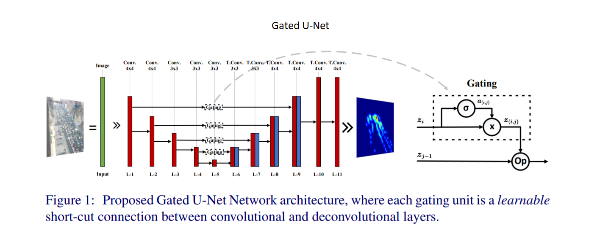

## [Improving Object Counting with Heatmap Regulation (Shubhra Aich and Ian Stavness, 2018)](https://arxiv.org/abs/1803.05494)
* They propose to enhance one-look regression counting models by regulating activation maps from the final conv layer of the NN with coarse GT density maps.
* The authors use Smooth-L1 and L1 loss functions to compute CAM (class activation maps) and count errors, respectively.  
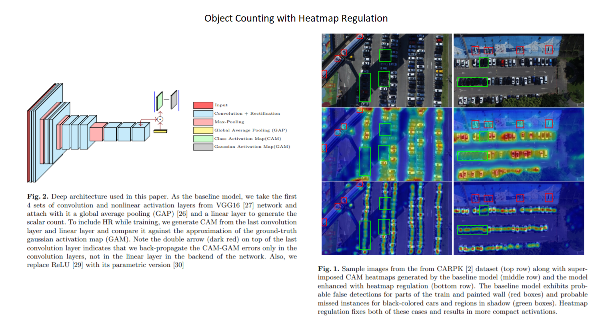

## [Generating High-Quality Crowd Density Maps using Contextual Pyramid CNNs (Vishwanath A. Sindagi and Vishal M. Patel, 2017)](https://arxiv.org/abs/1708.00953)
* 
* 
* 

## [Drone-based Object Counting by Spatially Regularized Regional Proposal Network (Meng-Ru Hsieh, Yen-Liang Lin and Winston H. Hsu, 2017)](https://arxiv.org/abs/1707.05972)
* They leverage the spatial layout information (e.g., cars often park regularly) and introduce these spatially regularized constraints into their network to improve the localization accuracy.
* The spatial layout information can be used to improve results of object counting tasks with regularized structures.
* They created the largest (in 2017) drone view dataset CARPK and modified PUCPR dataset to PUCPR+, which can be used for counting tasks.
> The regression-based methods can not generate precise object positions.  

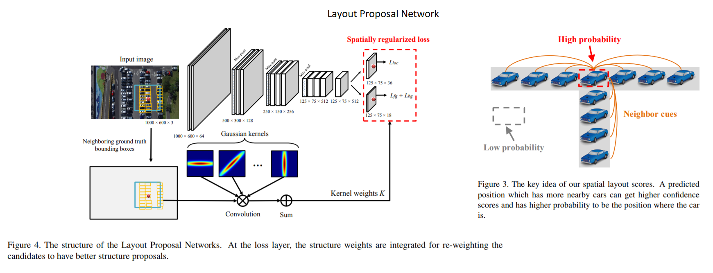

## [Count-ception: Counting by Fully Convolutional Redundant Counting (Joseph Paul Cohen, Genevieve Boucher, Craig A. Glastonbury, Henry Z. Lo and Yoshua Bengio, 2017)](https://arxiv.org/abs/1703.08710)
* Instead of predicting a density map, a redundant counting is proposed in order to average over the errors.
  The idea is to predict a count map which contains redundant counts based on the receptive field of a regression network.
* They also propose a new deep neural network for counting: Count-ception (adapted from the Inception family of networks).
* The Inception-like architecture allows them to obtain multi-scale feature representations and the small input size 32x32 prevents overfitting.
* Their approach results in a improvement (2.9 to 2.3 MAE) over the state of the art method by Xie and Zisserman in 2016.
* Comparison with density map approach (_Learning to count objects in images (Lempitsky, 2015)_):
  - Using Gaussian density map forces the model to predict specific values on how far the object is from the center of the receptive field.
    This is a harder task than just predicting the existence of the object in the receptive field.
  - Redundant counts method is explicitly designed to tolerate the errors when predictions are made (summation over the output of the model).
* Limitations:
  - The predicted count map can localize the regions of the counted objects but not specific coordinates.
* Training details:
  - _Leaky ReLU_. The output can be pushed to zero and then recover to predict the correct count.
  - _Large convolutions_ instead of max_pooling and stride=2 convolutions.
    It is easier to calculate the receptive field of the network.
    Strides add a modulus to the calculation of the count map size.
  - _BatchNorm_ after every convolution.
  - _L1 loss_.  
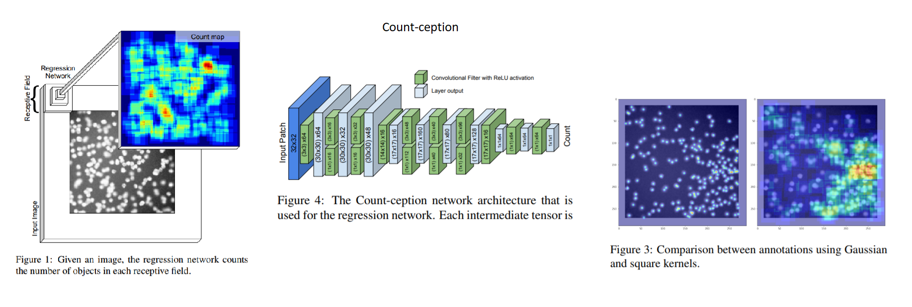
  

## [Microscopy cell counting and detection with fully convolutional regression networks (Weidi Xie, J. Alison Noble and Andrew Zisserman, 2016)](http://www.robots.ox.ac.uk/~vgg/publications/2016/Xie16/xie16.pdf)
* A very good paper in terms of clarity and coherence.
* They use fully convolutional NNs to regress a cell spatial density map that can be used for cell counting and detection.
* They show that FCRNs trained entirely on synthetic data are able to give excellent predictions on real microscopy images.
* The authors show that cell detection can be a side benefit of the cell counting task (based on density estimation, without the need for prior object detection and segmentation).
* An interesting experiment: inverting feature representations (given an encoding of an image, to what extent is it possible to reconstruct that image?)
  - when the networks get deeper, feature representations for cell clump become increasingly abstract (e.g., concavity information);
  - reconstruction quality decreases with the depth of the network, and only important information has been kept by deep layers.
* Details:
  - They pre-train FCRNs with 100x100 patches and fine-tune the parameters with whole images to smooth the estimated density maps.
  - When counting cells from large cell clumps, a larger receptive field is more important than being able to provide more detailed information over the receptive field.  
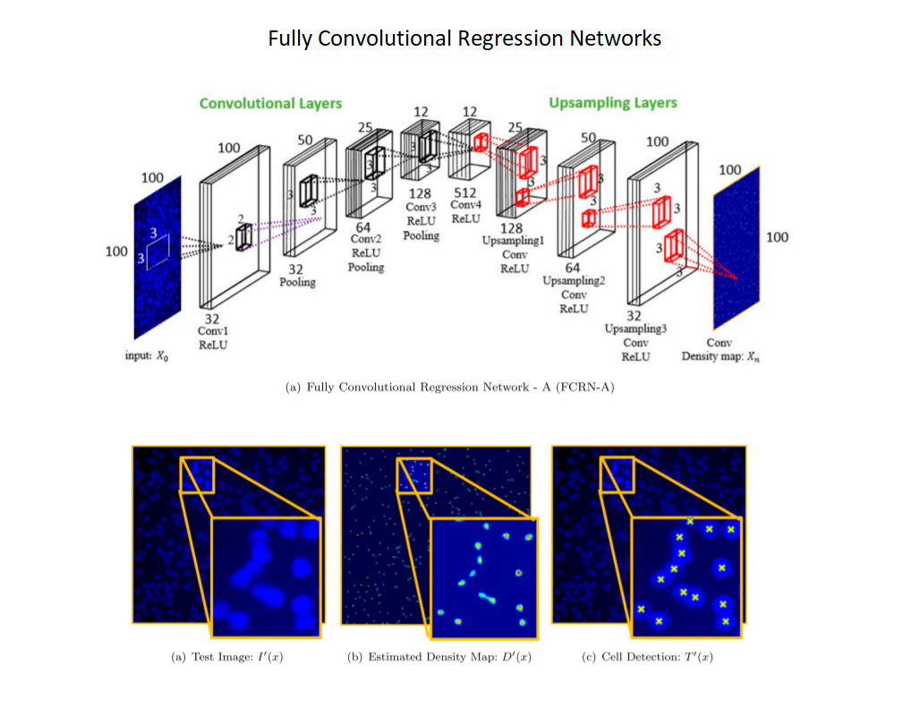
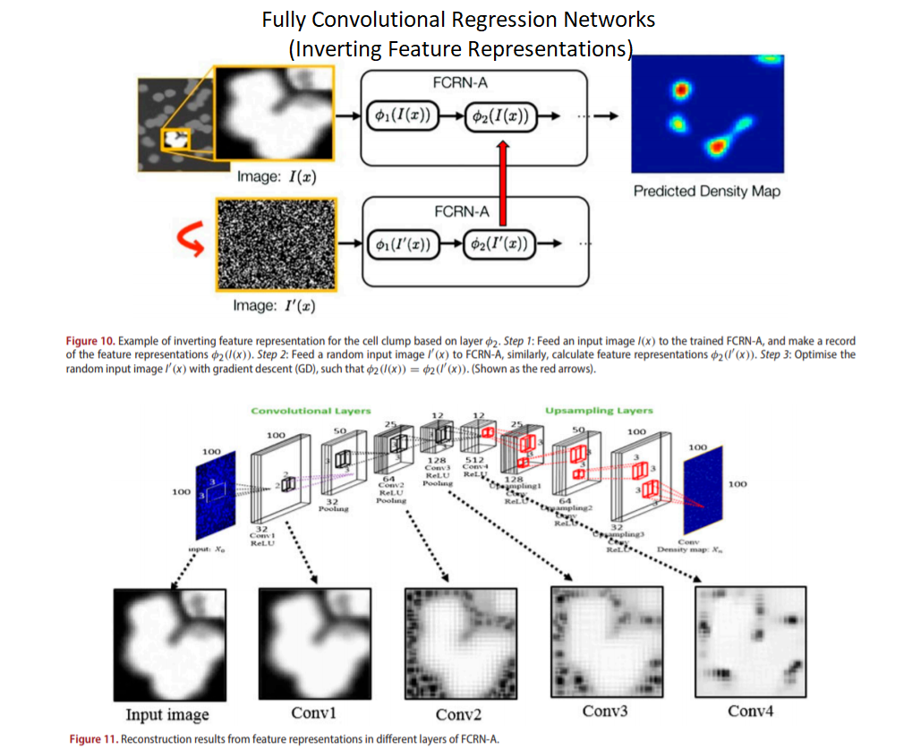

## [Learning to count with deep object features (Santi Seguí, Oriol Pujol and Jordi Vitrià, 2015)](https://arxiv.org/abs/1505.08082)
* Different from other approaches, the authors don't give any hint on the object they are counting besides the occurrence multiplicity.
  They follow a weakly supervised approach for object counting.
* They cast the object counting to a classification problem (CNN layers + FC layers) where the final FC layer has a fixed size: the maximum number of objects in a image.
  This is a drawback, because this method can be used only for images with few objects and the maximum number of objects has to be known apriori.
* Their experiments suggest that the task of object counting may be used as a surrogate for finding good representations for new tasks. 
> Classical regression functions are prone to errors when the input is high dimensional.  

## [Extremely Overlapping Vehicle Counting (Ricardo Guerrero-Gomez-Olmedo _et. al_, 2015)](http://agamenon.tsc.uah.es/Personales/rlopez/docs/ibpria2015-guerrero.pdf)
* 
*
* 

## [Learning To Count Objects in Images (Victor Lempitsky and Andrew Zisserman, 2010)](http://papers.nips.cc/paper/4043-learning-to-count-objects-in-images.pdf)
* Summary: http://www.robots.ox.ac.uk/~vgg/research/counting/index_new.html
* The authors propose to count objects in images through density estimation.
* The main idea is to estimate a continuous density function whose integral over any image region gives the count of objects within that region.
  In other words, each predicted object takes up a density of 1, so a sum of the density map will reveal the total number of objects in the image.
* Advantages of this approach:
  - avoids the hard task of learning to detect individual object instances;
  - is robust to crowding, overlap and size of the instances;
* Pipeline:
  1. Extract feature vectors (SIFT) at each pixel of the image;
  2. Learn a linear mapping from feature vector at each pixel to a density value, obtaining density function value in that pixel.  
  They use as loss the MESA (_Maximum Excess over SubArrays_) distance.  
  In their next paper (Interactive object counting, 2014), the loss is changed and the mapping coefficients are learned through a simple ridge regression.  
* In other words:
  - Density estimation with a supervised algorithm: 
  - __D(x) = c.T x phi(x)__  
    * D(x): ground-truth density map;  
	* phi(x): the local features;  
	* Parameters __c__ are learned by minimizing the error between the true and predicted density map with quadratic programming over all possible subwindows.  
* The MESA distance has the following (good/desirable) properties:
  - tolerates the local modifications (noise, jitter, change of Gaussian kernel) => robustness to the additive local perturbations;
  - reacts strongly to the change in the number of objects or their positions.  

## [Detecting, localizing and grouping repeated scene elements from an image (Leung, T., Malik, J., 1996)](http://citeseerx.ist.psu.edu/viewdoc/download?doi=10.1.1.36.2193&rep=rep1&type=pdf)
* A unsupervised approach for detecting and grouping repeated scene elements in an image.
* Their method can be seen like tracking an element to spatially neighboring locations in one image.
* Pipeline:
    1. _Detection of interesting windows_ (distinctive elements - possible candidates for the repeating elements) in the image.
	   A 2D candidate pattern/window is defined by the authors in a such way that first 2 eigenvalues of their 2nd moment matrix are large and comparable.
	2. _Finding matches_ and _estimating the affine transform_ between matching elements.
	   Two neighboring patches match if their sum of squared differences is small (<threshold).
	3. _Growing the pattern_ following the criterion that will decrease the matching error among the neighboring patches from step 2.
	4. _Grouping elements_ by looking at its 8 neighboring windows.  
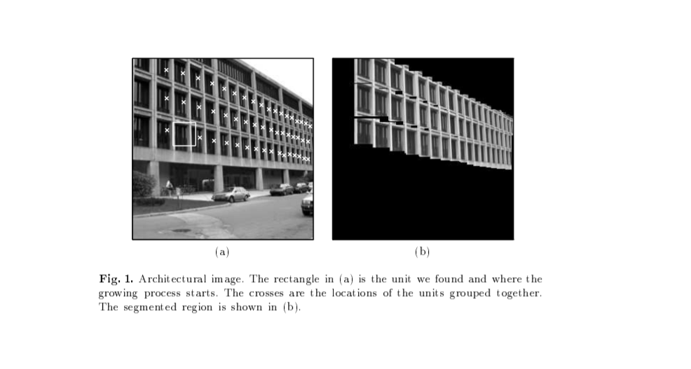

# Datasets related to counting

## Inria Aerial Image Labeling Dataset
* https://project.inria.fr/aerialimagelabeling/
* 180 tiff images (5000x5000) with ground truth (for 5 cities).
* ground truth: segmentation maps for buildings.

## Airbus Ship Detection Dataset
* https://www.kaggle.com/c/airbus-ship-detection/data
* 29 GB;
* 150,000 jpeg images (768x768) extracted from satellite imagery;
* images of tankers, commercial and fishing ships of various shapes and sizes;
* some images do not contain ships, but those that do may contain multiple ships;
* ground truth: oriented bounding boxes around the ships.
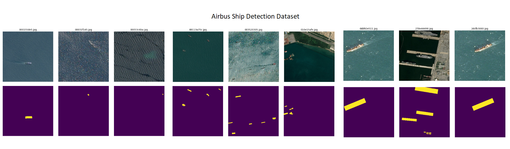

## NOAA Fisheries Steller Sea Lion Population Dataset
* https://www.kaggle.com/c/noaa-fisheries-steller-sea-lion-population-count/data
* 96 GB;
* aerial images of sea lions;
* ground truth: colored dots over the animals.

## VGG Cells Dataset
* http://academictorrents.com/details/b32305598175bb8e03c5f350e962d772a910641c
* a synthetic dataset;
* 200 png images (256x256) containing simulated bacterial cells from fluorescence-light microscopy;
* each image contains 174 +- 64 cells which overlap;
* ground truth: dot annotations.

## CARPK
* https://lafi.github.io/LPN/
* 1448 images (720x1280) (989 for train, 459 for test) of cars captured from different parking lots;
* 90,000 cars;
* maximum number of cars in a single scene: 188;
* ground truth: bounding boxes.
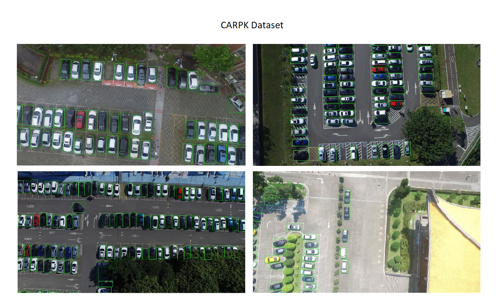

## PUCPR+
* https://lafi.github.io/LPN/
* modified annotations of PUCPR (initial dataset);
* 125 images (720x1280) (100 for train, 25 for test) of cars captured from a single parking lot, using fixed camera sensors that are placed in the same place;
* 17,000 cars;
* maximum number of cars in a single scene: 331;
* ground truth: bounding boxes.
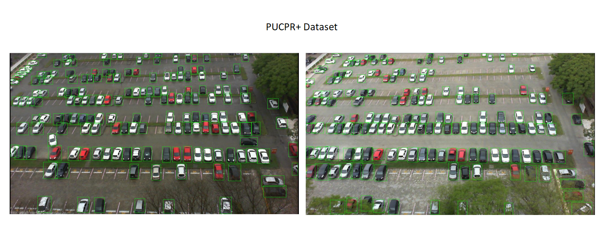

## TRANCOS
* http://agamenon.tsc.uah.es/Personales/rlopez/data/trancos/
* benchmark for (extremely overlapping) vehicle counting in traffic congestion situations;
* 1,244 (480x640) images;
* 46,796 annotated vehicles;
* remark: motorcycles are also annotated;
* ground truth: dot annotations and masks that define regions of interest used for evaluation.
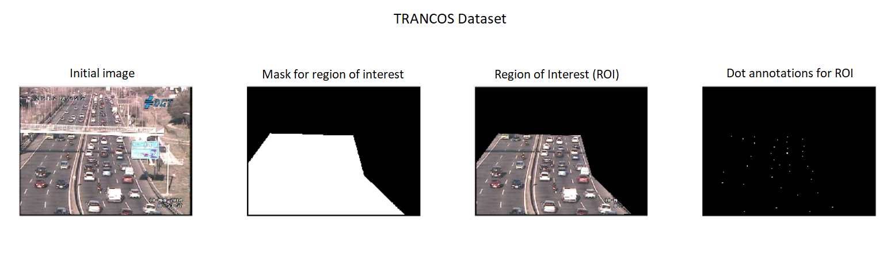

## Pedestrian counting datasets
*
*
*
