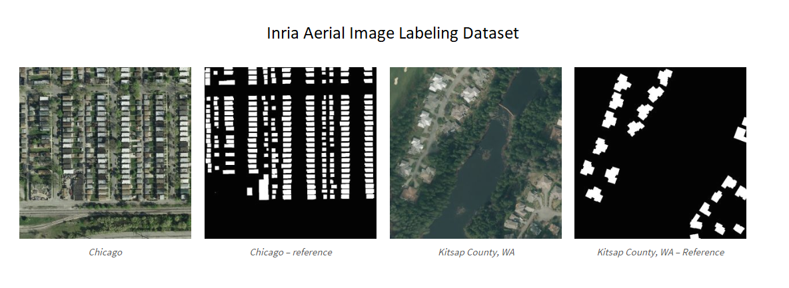
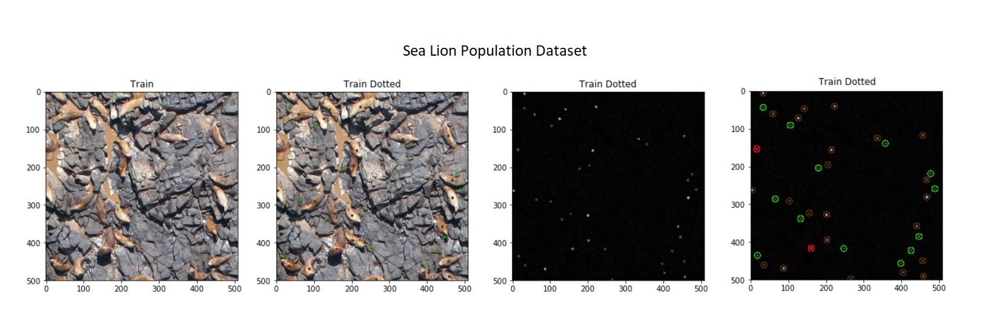
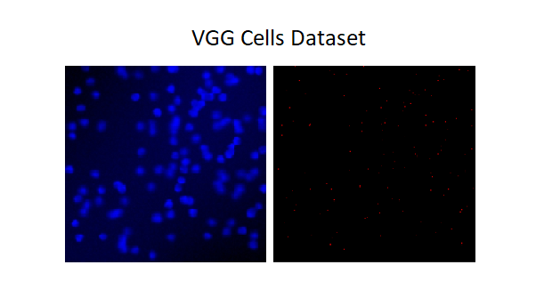

# Counting
1. __Supervised learning__
	- In the supervised case we know the location of the objects we learn to count.
	  I mean that the ground truth contains bounding boxes, dots or segmentation maps for objects of interest.
	- Methods:
        * Counting by detection;
        * Counting by regression;
        * Counting by segmentation;

2. __Weakly supervised learning__
    - Learning to count without giving locations of the objects. The system/method learns from the pair (image, number of objects).

3. __Semi-supervised learning__
	- A combination of supervised learning (few ground truth labels) and unsupervised learning (a lot of images without labels).

4. __Unsupervised learning__
    - Perform grouping based on self-similarities or motion similarities. No ground truth (labels) for objects of interest.
	
# Papers related to counting

## [Class-Agnostic Counting (Erika Lu, Weidi Xie and Andrew Zisserman, 2018)](https://arxiv.org/abs/1811.00472)
* 
* 
* 

## [Object Counting with Small Datasets of Large Images (Shubhra Aich and Ian Stavness, 2018)](https://arxiv.org/abs/1805.11123)
* 
* 
* 

## [Learning Short-Cut Connections for Object Counting (Daniel Oñoro-Rubio, Mathias Niepert and Roberto J. López-Sastre, 2018)](https://arxiv.org/abs/1805.02919)
* 
* 
* 

## [Improving Object Counting with Heatmap Regulation (Shubhra Aich and Ian Stavness, 2018)](https://arxiv.org/abs/1803.05494)
*
* 

## [Drone-based Object Counting by Spatially Regularized Regional Proposal Network (Meng-Ru Hsieh, Yen-Liang Lin and Winston H. Hsu, 2017)](https://arxiv.org/abs/1707.05972)
* 
* 
* 

## [Count-ception: Counting by Fully Convolutional Redundant Counting (Joseph Paul Cohen, Genevieve Boucher, Craig A. Glastonbury, Henry Z. Lo and Yoshua Bengio, 2017)](https://arxiv.org/abs/1703.08710)
* Instead of predicting a density map, a redundant counting is proposed in order to average over the errors.
  The idea is to predict a count map which contains redundant counts based on the receptive field of a regression network.
* They also propose a new deep neural network for counting: Count-ception (adapted from the Inception family of networks).
* Their approach results in a improvement (2.9 to 2.3 MAE) over the state of the art method by Xie and Zisserman in 2016.
* Comparison with density map approach (_Learning to count objects in images, (Lempitsky, 2015)_):
  - Using Gaussian density map forces the model to predict specific values on how far the object is from the center of the receptive field.
    This is a harder task than just predicting the existence of the object in the receptive field.
  - Redundant counts method is explicitly designed to tolerate the errors when predictions are made (summation over the output of the model).
* Limitations:
  - The predicted count map can localize the regions of the counted objects but not specific coordinates.
* Training details:
  - _Leaky ReLU_. The output can be pushed to zero and then recover to predict the correct count.
  - _Large convolutions_ instead of max_pooling and stride=2 convolutions.
    It is easier to calculate the receptive field of the network.
    Strides add a modulus to the calculation of the count map size.
  - _BatchNorm_ after every convolution.
  - _L1 loss_.  

  

## [Microscopy cell counting and detection with fully convolutional regression networks (Weidi Xie, J. Alison Noble and Andrew Zisserman, 2016)](http://www.robots.ox.ac.uk/~vgg/publications/2016/Xie16/xie16.pdf)
* 
* 
* 

## [Learning to count with deep object features (Santi Seguí, Oriol Pujol and Jordi Vitrià, 2015)](https://arxiv.org/abs/1505.08082)
* Different from other approaches, the authors don't give any hint on the object they are counting besides the occurrence multiplicity.
  They follow a weakly supervised approach for object counting.
* They cast the object counting to a classification problem (CNN layers + FC layers) where the final FC layer has a fixed size: the maximum number of objects in a image.
  This is a drawback, because this method can be used only for images with few objects and the maximum number of objects has to be known apriori.
* Their experiments suggest that the task of object counting may be used as a surrogate for finding good representations for new tasks. 
> Classical regression functions are prone to errors when the input is high dimensional.  

## [Learning To Count Objects in Images (Victor Lempitsky and Andrew Zisserman, 2010)](http://papers.nips.cc/paper/4043-learning-to-count-objects-in-images.pdf)
* Summary: http://www.robots.ox.ac.uk/~vgg/research/counting/index_new.html
* The authors propose to count objects in images through density estimation.
* The main idea is to estimate a continuous density function whose integral over any image region gives the count of objects within that region.
  In other words, each predicted object takes up a density of 1, so a sum of the density map will reveal the total number of objects in the image.
* Advantages of this approach:
  - avoids the hard task of learning to detect individual object instances;
  - is robust to crowding, overlap and size of the instances;
* Pipeline:
  1. Extract feature vectors (SIFT) at each pixel of the image;
  2. Learn a linear mapping from feature vector at each pixel to a density value, obtaining density function value in that pixel.  
  They use as loss the MESA (_Maximum Excess over SubArrays_) distance.  
  In their next paper (Interactive object counting, 2014), the loss is changed and the mapping coefficients are learned through a simple ridge regression.  
* The MESA distance has the following (good/desirable) properties:
  - tolerates the local modifications (noise, jitter, change of Gaussian kernel) => robustness to the additive local perturbations;
  - reacts strongly to the change in the number of objects or their positions.  

## [Detecting, localizing and grouping repeated scene elements from an image (Leung, T., Malik, J., 1996)](https://pdfs.semanticscholar.org/7ab3/7ee19f7ff2df34c62d1eaa6c4cb9eb14a771.pdf)
* 
* 
* 

# Datasets related to counting

## Inria Aerial Image Labeling Dataset
* https://project.inria.fr/aerialimagelabeling/
* 180 tiff images (5000x5000) with ground truth (for 5 cities).
* ground truth: segmentation maps for buildings.  

## Airbus Ship Detection Dataset
* https://www.kaggle.com/c/airbus-ship-detection/data
* 29 GB;
* 150,000 jpeg images (768x768) extracted from satellite imagery;
* images of tankers, commercial and fishing ships of various shapes and sizes;
* some images do not contain ships, but those that do may contain multiple ships;
* ground truth: oriented bounding boxes around the ships.  

## NOAA Fisheries Steller Sea Lion Population Dataset
* https://www.kaggle.com/c/noaa-fisheries-steller-sea-lion-population-count/data
* 96 GB;
* aerial images of sea lions;
* ground truth: colored dots over the animals.  

## VGG Cells Dataset
* http://academictorrents.com/details/b32305598175bb8e03c5f350e962d772a910641c
* 200 png images (256x256) containing simulated bacterial cells from fluorescence-light microscopy;
* each image contains 174 +- 64 cells which overlap;
* ground truth: dot annotations.  

## CARPK
*
*
*

## Pedestrian counting datasets
*
*
*