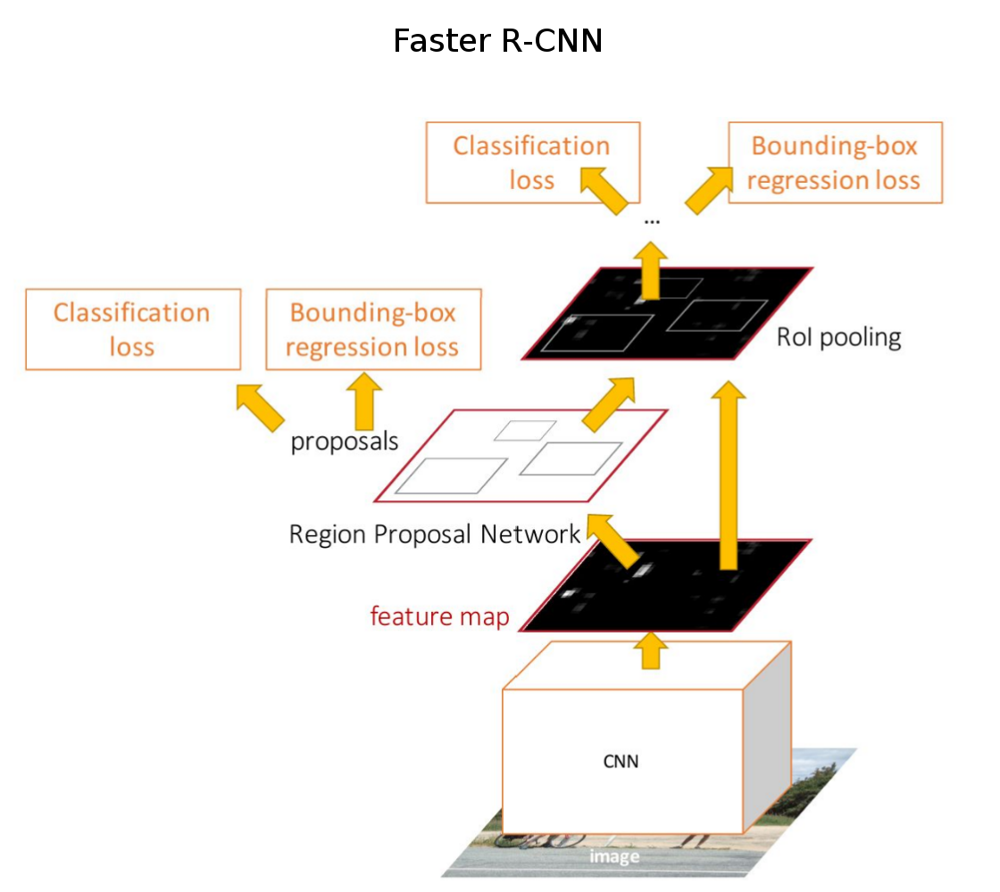
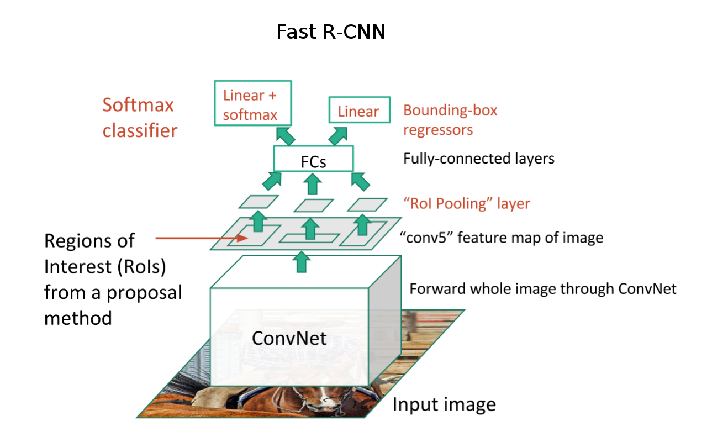
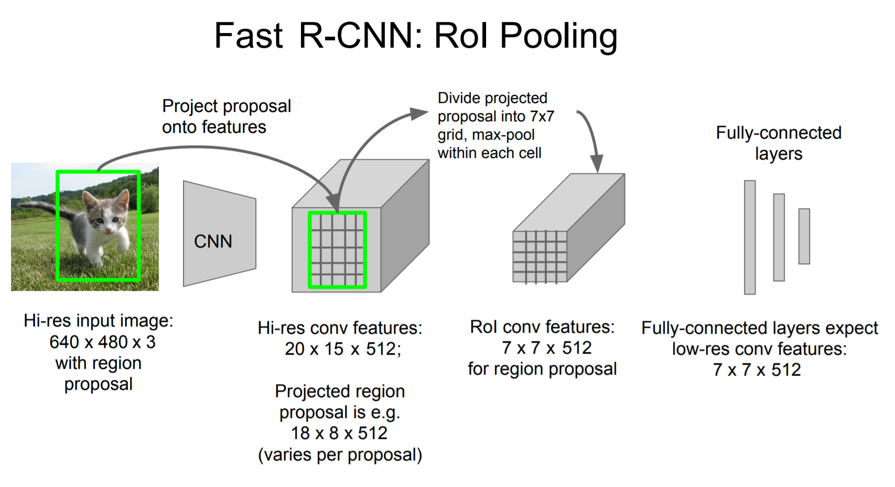
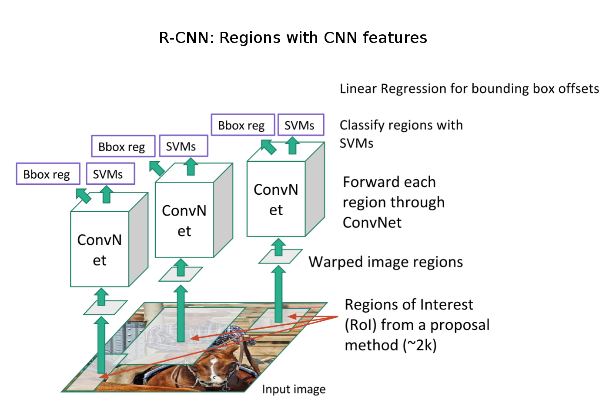

# Detection
1. [Papers related to object detection](#papers-related-to-object-detection)  
    *  __2018__
	    - [YOLOv3: An Incremental Improvement (Joseph Redmon and Ali Farhadi, 2018)](#yolov3-an-incremental-improvement-joseph-redmon-and-ali-farhadi-2018)
	*  __2017__
	    - [Focal Loss for Dense Object Detection (Tsung-Yi Lin et al., 2017)](#focal-loss-for-dense-object-detection-tsung-yi-lin-priya-goyal-ross-girshick-kaiming-he-and-piotr-dollar-2017)
	*  __2016__
	    - [YOLO9000: Better, Faster, Stronger (Joseph Redmon and Ali Farhadi, 2016)](#yolo9000-better-faster-stronger-joseph-redmon-and-ali-farhadi-2016)
	    - [SSD: Single Shot MultiBox Detector (Wei Liu et al., 2016)](#ssd-single-shot-multibox-detector-wei-liu-dragomir-anguelov-dumitru-erhan-christian-szegedy-scott-reed-cheng-yang-fu-and-alexander-c-berg-2016)
	    - [You Only Look Once: Unified, Real-Time Object Detection (Joseph Redmon et al., 2016)](#you-only-look-once-unified-real-time-object-detection-joseph-redmon-santosh-divvala-ross-girshick-and-ali-farhadi-2016)
	*  __2015__
	    - [Faster R-CNN: Towards Real-Time Object Detection with Region Proposal Networks (Shaoqing Ren et al., 2015)](#faster-r-cnn-towards-real-time-object-detection-with-region-proposal-networks-shaoqing-ren-kaiming-he-ross-girshick-and-jian-sun-2015)
        - [Fast R-CNN (Ross Girshick, 2015)](#fast-r-cnn-ross-girshick-2015)
	*  __2014__
	    - [Rich feature hierarchies for accurate object detection and semantic segmentation (Ross Girshick et al., 2014)](#rich-feature-hierarchies-for-accurate-object-detection-and-semantic-segmentation-ross-girshick-jeff-donahue-trevor-darrell-and-jitendra-malik-2014)

# Papers related to object detection
## [YOLOv3: An Incremental Improvement (Joseph Redmon and Ali Farhadi, 2018)](https://arxiv.org/abs/1804.02767)
*
*

## [Focal Loss for Dense Object Detection (Tsung-Yi Lin, Priya Goyal, Ross Girshick, Kaiming He and Piotr Dollar, 2017)](https://arxiv.org/abs/1708.02002)
*
*

## [YOLO9000: Better, Faster, Stronger (Joseph Redmon and Ali Farhadi, 2016)](https://arxiv.org/abs/1612.08242)
*
*

## [SSD: Single Shot MultiBox Detector (Wei Liu, Dragomir Anguelov, Dumitru Erhan, Christian Szegedy, Scott Reed, Cheng-Yang Fu and Alexander C. Berg, 2016)](https://arxiv.org/abs/1512.02325)
*
*

## [You Only Look Once: Unified, Real-Time Object Detection (Joseph Redmon, Santosh Divvala, Ross Girshick and Ali Farhadi, 2016)](https://arxiv.org/abs/1506.02640)
*
*

## [Faster R-CNN: Towards Real-Time Object Detection with Region Proposal Networks (Shaoqing Ren, Kaiming He, Ross Girshick and Jian Sun, 2015)](https://arxiv.org/abs/1506.01497)
* Faster R-CNN is a single, unified network for object detection, which is composed of 2 modules:
  - Region Proposal Network (RPN): a fully convolutional network that proposes regions;
      * Input: image of any size;
	  * Output: a set of rectangular object proposals, each with an objectness score;
  - Fast R-CNN detector that uses the proposed regions;
      * Input: feature maps & proposals generated by RPN;
	  * Output: a set of bounding boxes, each with a class label;
* Both networks (RPN & Fast R-CNN) share a common set of conv layers;
* Advantages of RPN over Selective Search method (used in many detection systems):
  - is 2 orders of magnitude faster;
  - can learn from data, and thus can easily benefit from deeper and more expressive features;
* RPNs are designed to predict region proposals at different scales and aspect ratios.
  - The authors introduce novel anchor boxes that serve as references at multiple scales and aspect ratios.
  - The idea of using anchors avoids pyramids of images/feature maps, filters with multiple scales/sizes and better handles (needs less memory & is faster) the scale variance issue.
  - For each sliding-window location, RPN simultaneously predicts multiple region proposals.
  - The k=9 (scale x aspect ratio = {128^2, 256^2, 512^2} x {1:1, 1:2, 2:1}) proposals are parameterized relatively to k reference boxes (==anchors).
  - For a conv feature map of a size W\*H (typically ~2400), there are W\*H\*k anchors in total.
  - The design of multi-scale anchors is a key component for sharing features without extra cost for addressing scales.
* RPN training:
  - Anchors:
	  * Positive examples:
		  1. anchor/anchors with the highest IoU overlap with a GT box;
		  2. anchors that have an IoU overlap higher than 0.7 with any GT box;
	  * Negative examples:
		  1. non-positive boxes with IoU lower than 0.3 for all GT boxes;
	  * Anchors that are neither positive nor negative do not contribute to the training objective.
  - RPN is trained to minimize an objective function following the multi-task loss (similar to Fast R-CNN):
      * Classification of object proposals (object versus not object);
	  * Refinement of their spatial locations with k different bounding-box regressors (k=9 is the number of anchors for each location).  
	  Remember: a proposal is associated with k=9 anchor boxes.
  - Each mini-batch arises from a single image and contains 256 randomly sampled anchors (128:128 positive/negative examples).
  - The shared conv layers are initialized by pre-training a model on ImageNet classification (ZF net or VGG16).
* RPN & Fast R-CNN training (4-step alternating training):
  1. RPN:
      - Initialize RPN with a model pre-trained on ImageNet;
	  - Fine-tune RPN for the region proposal task;
  2. Fast R-CNN:
      - Initialize Fast R-CNN with a model pre-trained on ImageNet;
	  - Train Fast R-CNN for detection using the proposals generated by the step 1;
      - At this stage, there are 2 separate networks that do not share the convolutional layers;
  3. RPN:
      - Initialize RPN using Fast R-CNN weights;
	  - Fix the shared convolutional layers;
	  - Fine-tune only the layers unique to RPN;
	  - At this stage, the 2 networks share convolutional layers;
  4. Fast R-CNN:
      - Keeping the shared conv layers, fine-tune the unique layers of Fast R-CNN;
	  - At this stage, both networks share the same conv layers and form a unified network.
* The number of RPN proposals is reduced with non-maximum suppression (NMS, thr=0.7) based on their classification scores (object versus not object).
* After NMS, top-N ranked proposals are used for detection:
  - 2000 RPN proposals during training;
  - a smaller number (300 is a good choice for PASCAL VOC) of proposals at test-time.
* State-of-the-art results (in 2015) on the following datasets:
  - PASCAL VOC 2012 (67.0%/70.4%/75.9% mAP with VOC12/(VOC07+VOC12)/(COCO+VOC07+VOC12) train set) with VGG16 backbone (5fps);
  - MS COCO (42.7% PASCAL-style mAP or 21.9% COCO-style AP).
* More info: [Faster R-CNN (towards-data-science)](https://towardsdatascience.com/faster-r-cnn-for-object-detection-a-technical-summary-474c5b857b46) | 
[Experiments & results](https://www.youtube.com/watch?v=306ieamtvGM&list=PLkRkKTC6HZMzp28TxR_fJYZ-K8Yu3EQw0&index=6)  
  
[Image source](http://cs231n.stanford.edu/slides/2017/cs231n_2017_lecture11.pdf)

## [Fast R-CNN (Ross Girshick, 2015)](https://arxiv.org/abs/1504.08083)
* The proposed Fast R-CNN method can be described in the following way.  
For a given input image and a set of object proposals, the detection algorithm consists of the next steps:
  1. Feature extraction for the entire input image using the convolutional part (conv-relu-maxpool layers) of a CNN (VGG16, pre-trained on ImageNet);
      - Output: feature maps for the input image;
  2. For each object proposal, a region of interest (RoI) pooling layer extracts a fixed-length feature vector from the feature maps (computed at previous step);
      - RoI pooling layer uses max-pooling to convert features inside any valid RoI into a small feature map with a fixed size H*W (7x7 in case of VGG16, to be compatible with the first FC layer of the network);
	  - H and W are independent of any particular RoI;
	  - We can apply this operation/layer to regions with variable sizes and map them to feature maps with a fixed size. 
	  This allows a fully convolutional processing of images and region proposals with variable sizes.
  3. Each feature vector is fed into a sequence of FC layers that branch into 2 output layers and produce:
      * Softmax probabilities for k object classes + 1 "background" class;
	  * Per-class bounding-box regression offsets (4 values for each bounding box).
* Advantages of Fast R-CNN:
  - Fast training and inference;
      * When VGG16 is used as feature extractor (in both R-CNN and Fast R-CNN), Fast R-CNN is 9x faster during the training stage and 213x faster at test-time.
	  * Details:
	      - R-CNN is slow because it performs a CNN forward pass for each object proposal, without sharing computation.
	      - Fast R-CNN is fast because it performs a single forward pass for all object proposals from an image.
		  Feature extraction for each region proposal represents a simple projection of RoI in the computed feature maps.
  - Higher detection quality (mAP) than R-CNN and SPPnet;
  - Training is single-stage, using a multi-task loss;
      * Multi-task loss for classification of object proposals and refinement of their spatial locations.
  - Training can update all network layers;
  - No disk storage is required for feature caching.
* Training details:
  - Mini-batches of size 128 (2 random images x 64 region proposals from each image);
  - 25%/75% positive/negative examples in a mini-batch;
      * Positive examples: proposals with >= 0.5 IoU with a ground-truth bounding box;
	  * Negative examples: proposals with IoU in [0.1, 0.5);
  - Only layers from conv3_1 and up are fine-tuned (when VGG16 is used).
* State-of-the-art results (in 2015) on the following datasets:
  - PASCAL VOC 2012 (65.7%/68.4% mAP with VOC12/(VOC07+VOC12) train set);
  - MS COCO (35.9% PASCAL-style mAP or 19.7% COCO-style AP).
* More info: [Fast R-CNN (towards-data-science)](https://towardsdatascience.com/fast-r-cnn-for-object-detection-a-technical-summary-a0ff94faa022)  
  
  
[Image source](http://cs231n.stanford.edu/slides/2017/cs231n_2017_lecture11.pdf)

## [Rich feature hierarchies for accurate object detection and semantic segmentation (Ross Girshick, Jeff Donahue, Trevor Darrell and Jitendra Malik, 2014)](https://arxiv.org/abs/1311.2524)
* The authors propose a simple method for object detection called R-CNN (Regions with CNN features):
  1. Extract ~2000 region proposals using selective search method;
  2. Compute features for each proposal using a large CNN (AlexNet);
  3. Classify each region using class-specific linear SVMs;
  4. Apply class-specific bounding box regressors on each detection to improve the localization performance.
* Training:
  1. Supervised pre-training on ILSVRC2012 classification dataset;
  2. Domain-specific fine-tuning (only on warped region proposals):
      * Replace 1000-way classification layer with a (N + 1)-way classification layer (N is the number of object classes, plus 1 for background);
	  * Region proposals with >= 0.5 IoU overlap with a GT box are considered positives for that box's class and the rest as negatives;
	  * Construct a mini-batch: 32 positive windows (uniformly sampled over all classes) + 96 background windows;
	  * Fine-tune with a learning rate of 0.001 (1/10th of the initial pre-training rate).
  3. Object category classifiers (train N different SVM classifiers):
      * Extract features from the fine-tuned CNN and train one linear SVM per class;
	  * The positive and negative examples are defined differently at this stage (compared to fine-tuning):
	      - Only the GT bounding boxes are positive examples for their respective classes (== 1.0 IoU);
		  - Proposals with < 0.3 IoU overlap with all instances of a class are negative examples for that class;
		  - Proposals with IoU in [0.3, 1.0) are ignored.
	  * For PASCAL VOC datasets, adopt standard hard negative mining for a faster convergence (=> mAP stops increasing after only a single pass over all images).
  4. Bounding box regression:
      * Train a linear regression model (for each class separately) to predict a new detection window given the predicted bounding box and its pool5 features;
      * This improves the localization performance of the model.
  - Different definitions of positives and negatives in fine-tuning and SVM training allow:
      * at fine-tuning stage: to create more positive examples (x30) => a larger dataset => avoids overfitting, but the network is not fine-tuned for precise localization;
	  * at SVM training stage: to emphasize precise localization.
* Test-time detection:
  1. Use selective search on the test image to extract ~2000 region proposals;
  2. Warp each region proposal to a fixed size (227x227);
  3. Extract a 4096 feature vector for each warped region proposal (with CNN: AlexNet);
  4. For each class, score each extracted feature vector using SVM trained for that class;
  5. Given all scored regions in an image, apply greedy non-maximum suppression (NMS) (for each class independently):
      * reject a region if there is another region with a higher score and their IoU is larger than a learned threshold;
	  * for each class independently == apply this method only for regions from the same class;
	  * NMS removes duplicates and false positives.
* Problems of the proposed R-CNN:
  - Training is a slow multi-stage process;
  - Inference is very slow: 47s/image when VGG16 is used for feature extraction;
  - Region proposals are category-independent (the generation method is fixed and cannot be adapted for specific domains).
* State-of-the-art results (in 2014) on the following datasets:
  - PASCAL VOC 2012 (53.3% mAP);
  - ILSVRC2013 (31.4% mAP).
* More info: [R-CNN (towards-data-science)](https://towardsdatascience.com/r-cnn-for-object-detection-a-technical-summary-9e7bfa8a557c)  
  
[Image source](http://cs231n.stanford.edu/slides/2017/cs231n_2017_lecture11.pdf)

