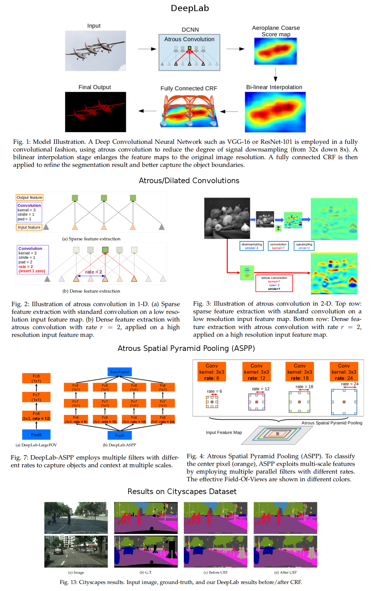
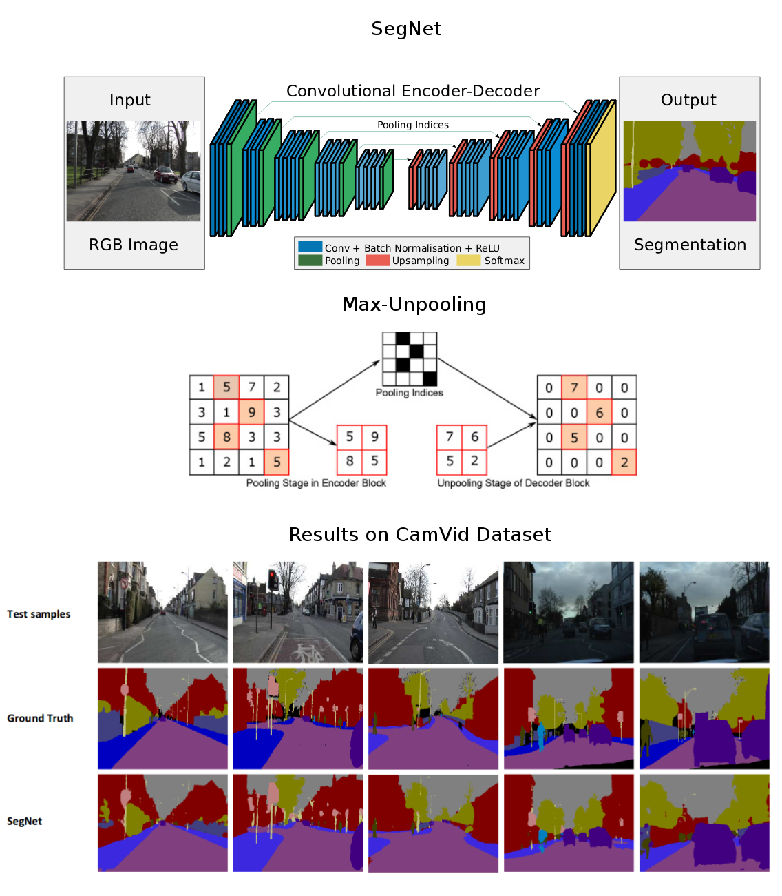
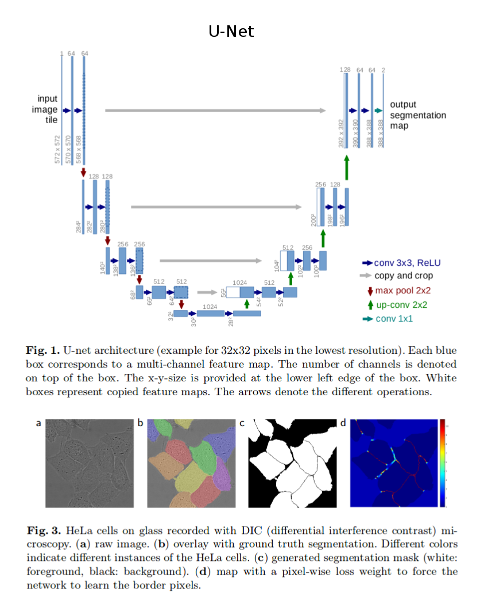
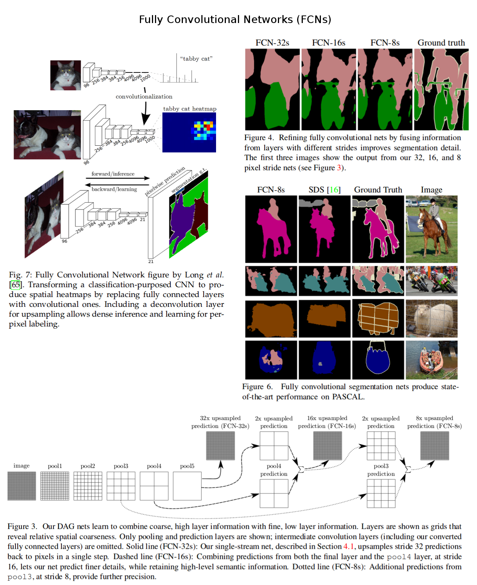

# Semantic Segmentation
1. [Evaluation metrics](#evaluation-metrics)
2. [Papers related to semantic segmentation](#papers-related-to-semantic-segmentation)  
    *  __2019__  
        - [Gated-SCNN: Gated Shape CNNs for Semantic Segmentation (Towaki Takikawa et al., 2019)](#gated-scnn-gated-shape-cnns-for-semantic-segmentation-towaki-takikawa-david-acuna-varun-jampani-and-sanja-fidler-2019)
    *  __2017__
	    - [DeepLab: Semantic Image Segmentation with Deep Convolutional Nets, Atrous Convolution, and Fully Connected CRFs (Liang-Chieh Chen et al., 2017)](#deeplab-semantic-image-segmentation-with-deep-convolutional-nets-atrous-convolution-and-fully-connected-crfs-liang-chieh-chen-george-papandreou-iasonas-kokkinos-kevin-murphy-and-alan-l-yuille-2017)
	*  __2016__
	    - [SegNet: A Deep Convolutional Encoder-Decoder Architecture for Image Segmentation (Vijay Badrinarayanan et al., 2016)](#segnet-a-deep-convolutional-encoder-decoder-architecture-for-image-segmentation-vijay-badrinarayanan-alex-kendall-and-roberto-cipolla-2016)
	*  __2015__
	    - [U-Net: Convolutional Networks for Biomedical Image Segmentation (Olaf Ronneberger et al., 2015)](#u-net-convolutional-networks-for-biomedical-image-segmentation-olaf-ronneberger-philipp-fischer-and-thomas-brox-2015)
        - [Fully Convolutional Networks for Semantic Segmentation (Jonathan Long et al., 2015)](#fully-convolutional-networks-for-semantic-segmentation-jonathan-long-evan-shelhamer-and-trevor-darrell-2015)

		
# Evaluation metrics
* __Mean Intersection over Union (mIoU)/Jaccard Index__:
  - more sensitive to outliers (FPs);
  - favors region smoothness and does not evaluate boundary accuracy like Boundary F1-measure;
* __Dice Coefficient (F1-measure)__:
  - less sensitive to outliers (FPs);
* __Boundary F1-measure (BF)__:
  - measures how close the predicted boundary of an object matches the ground truth boundary.
 
	  
# Papers related to semantic segmentation
## [Gated-SCNN: Gated Shape CNNs for Semantic Segmentation (Towaki Takikawa, David Acuna, Varun Jampani and Sanja Fidler, 2019)](https://arxiv.org/abs/1907.05740)
*
*

## [DeepLab: Semantic Image Segmentation with Deep Convolutional Nets, Atrous Convolution, and Fully Connected CRFs (Liang-Chieh Chen, George Papandreou, Iasonas Kokkinos, Kevin Murphy and Alan L. Yuille, 2017)](https://arxiv.org/abs/1606.00915)
* The main contributions of the proposed DeepLab system:
  - Atrous/dilated convolutions:
    * enlarge the field of view of filters to incorporate larger context without increasing the number of parameters;
	* avoid spatial resolution coarsening.
  - Fully connected CRFs for segmentation post-processing:
    * extra smoothing for better local consistency;
	* align segment boundaries with sharp changes in the image.
  - Atrous Spatial Pyramid Pooling (ASPP):
    * robustly segment objects at multiple scales;
* Architecture:
  - Start from a classification CNN (VGG-16/ResNet-101), pre-trained on ImageNet;
  - Fully connected layers -> 1x1 convolutions;
  - Last several conv + pool blocks -> dilated convolutions with stride=1, rate>1 or ASPP;
  - Upsampling (bilinear interpolation);
  - Post-processing with CRFs.
* State-of-the-art results (in 2016-2017) on the following datasets:
  - PASCAL VOC 2012 (79.7% mean IoU);
  - PASCAL-Context (45.7% mean IoU);
  - PASCAL-Person-Part (64.94% mean IoU);
  - Cityscapes (70.4% mean IoU). 
* More info: [DeepLab site](http://liangchiehchen.com/projects/DeepLab.html) | [DeepLab Youtube](https://www.youtube.com/watch?v=b6jhopSMit8)  

## [SegNet: A Deep Convolutional Encoder-Decoder Architecture for Image Segmentation (Vijay Badrinarayanan, Alex Kendall and Roberto Cipolla, 2016)](https://arxiv.org/abs/1511.00561)
* The motivation:
  - The need of an architecture for road and indoor scene understanding, which is efficient both in terms of memory and computational time.
  - Architectures which store the encoder feature maps in full (FCN, DeconvNet, etc.) perform best but consume more memory during inference time.
* The authors introduce SegNet: an encoder-decoder network for semantic segmentation task.
  - Encoder: first 13 convolutional layers of VGG16 (pre-trained on ImageNet);
  - Decoder: upsampling with "max-unpooling" + convolutions;
* The novelty of their approach is in the upsampling approach:
  - Max-unpooling: upsample the input using the pool indices from the encoder => improves boundary delineation & does not use full encoder feature maps (more efficient).
  - To densify the result of max-unpooling operation (i.e., sparse feature maps), convolutions are used at the next layer.
* The model is evaluated on outdoor and indoor scene segmentation datasets:
  - CamVid road scene segmentation;
  - SUN RGB-D indoor scene segmentation.
* More info: [SegNet site](http://mi.eng.cam.ac.uk/projects/segnet/)  

 

## [U-Net: Convolutional Networks for Biomedical Image Segmentation (Olaf Ronneberger, Philipp Fischer and Thomas Brox, 2015)](https://arxiv.org/abs/1505.04597)
* They extend [FCN](https://arxiv.org/abs/1411.4038) by adding skip-connections from encoder to decoder:
  - Each block of feature maps from encoder is copied and concatenated to the corresponding block from decoder.
  - In this way, the fine/low-level information from the encoder layers is propagated to the higher layers in order to improve the localization accuracy of predictions.
  - The encoder (downsampling path) is more or less symmetric to the decoder (upsampling path) and yield a u-shaped architecture. This is why the network is called U-Net. 
* This model achieves good results on biomedical image segmentation tasks:
  - State-of-the-art performance on EM segmentation challenge (2015) and ISBI cell tracking challenge (2015).  

## [Fully Convolutional Networks for Semantic Segmentation (Jonathan Long, Evan Shelhamer and Trevor Darrell, 2015)](https://arxiv.org/abs/1411.4038)
* This paper contains the main ingredients we should use when we build a model for semantic segmentation task:
  - Fully convolutional networks to make dense predictions (use only convolutional layers);
  - Initialization & transfer learning matters: fine-tuning pre-trained encoders can results in better feature extractors;
  - Upsampling can be learned: use transposed convolutions (warning: [checkerboard artifacts](https://distill.pub/2016/deconv-checkerboard/)) instead of fixed bilinear interpolation. 
  - Fusion of shallow, fine layers (with low-level, spatial information: where) and deep, coarse layers (with high-level, semantic information: what) for accurate and detailed segmentations.
* The authors transform the well-known classification models (AlexNet, VGG16, etc.) into fully convolutional nets (FCNs). They replace fully connected layers with convolutional ones to output spatial maps instead of classification scores.
* The encoder/feature extractor:
  - convolutionalized AlexNet, VGG16, GoogLeNet (all pre-trained on ImageNet);
  - best results achieved with VGG16;
* The network is pre-trained on the classification problem and fine-tuned on the segmentation task;
* FCN is refined by fusing (element-wise addition) spatial information from shallow layers with semantic information from deep layers.
  - Low-level features (shallow layers): good spatial location information, weak semantic information;
  - High-level features (deep layers): weak spatial location information, good semantic information;
  - Combination of both low-level and high-level features lets the model to make better local predictions that respect the global structure.
* State-of-the-art results (in 2015) on PASCAL VOC 2011 (62.7% mean IoU) and PASCAL VOC 2012 (62.2% mean IoU) datasets.  

