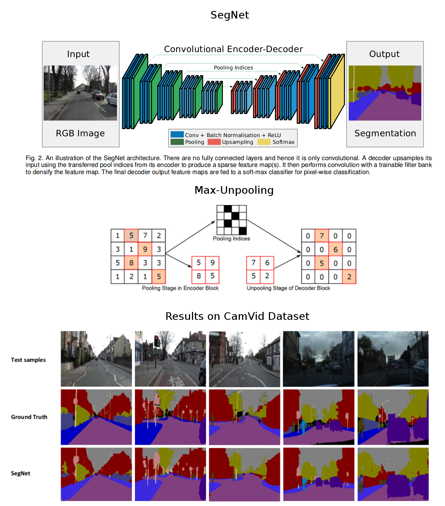

# Semantic Segmentation
1. [Evaluation metrics](#evaluation-metrics)
2. [Papers related to semantic segmentation](#papers-related-to-semantic-segmentation)  
    *  __2019__
        - [Gated-SCNN: Gated Shape CNNs for Semantic Segmentation (Towaki Takikawa et al., 2019)](#gated-scnn-gated-shape-cnns-for-semantic-segmentation-towaki-takikawa-david-acuna-varun-jampani-and-sanja-fidler-2019)
    *  __2018__
	    - [Dual Attention Network for Scene Segmentation (Jun Fu et al., 2018)](#dual-attention-network-for-scene-segmentation-jun-fu-jing-liu-haijie-tian-yong-li-yongjun-bao-zhiwei-fang-and-hanqing-lu-2018)
        - [BiSeNet: Bilateral Segmentation Network for Real-time Semantic Segmentation (Changqian Yu et al., 2018)](#bisenet-bilateral-segmentation-network-for-real-time-semantic-segmentation-changqian-yu-jingbo-wang-chao-peng-changxin-gao-gang-yu-and-nong-sang-2018)
		- [Encoder-Decoder with Atrous Separable Convolution for Semantic Image Segmentation (Liang-Chieh Chen et al., 2018)](#encoder-decoder-with-atrous-separable-convolution-for-semantic-image-segmentation-liang-chieh-chen-yukun-zhu-george-papandreou-florian-schroff-and-hartwig-adam-2018)
    *  __2017__
        - [Rethinking Atrous Convolution for Semantic Image Segmentation (Liang-Chieh Chen et al., 2017)](#rethinking-atrous-convolution-for-semantic-image-segmentation-liang-chieh-chen-george-papandreou-florian-schroff-and-hartwig-adam-2017)
	    - [Pyramid Scene Parsing Network (Hengshuang Zhao et al., 2017)](#pyramid-scene-parsing-network-hengshuang-zhao-jianping-shi-xiaojuan-qi-xiaogang-wang-and-jiaya-jia-2017)
	    - [Dilated Residual Networks (Fisher Yu et al., 2017)](#dilated-residual-networks-fisher-yu-vladlen-koltun-and-thomas-funkhouser-2017)
	    - [Understanding Convolution for Semantic Segmentation (Panqu Wang et al., 2017)](#understanding-convolution-for-semantic-segmentation-panqu-wang-pengfei-chen-ye-yuan-ding-liu-zehua-huang-xiaodi-hou-and-garrison-cottrell-2017)
	    - [DeepLab: Semantic Image Segmentation with Deep Convolutional Nets, Atrous Convolution, and Fully Connected CRFs (Liang-Chieh Chen et al., 2017)](#deeplab-semantic-image-segmentation-with-deep-convolutional-nets-atrous-convolution-and-fully-connected-crfs-liang-chieh-chen-george-papandreou-iasonas-kokkinos-kevin-murphy-and-alan-l-yuille-2017)
	*  __2016__
	    - [Multi-Scale Context Aggregation by Dilated Convolutions (Fisher Yu and Vladlen Koltun, 2016)](#multi-scale-context-aggregation-by-dilated-convolutions-fisher-yu-and-vladlen-koltun-2016)
	    - [SegNet: A Deep Convolutional Encoder-Decoder Architecture for Image Segmentation (Vijay Badrinarayanan et al., 2016)](#segnet-a-deep-convolutional-encoder-decoder-architecture-for-image-segmentation-vijay-badrinarayanan-alex-kendall-and-roberto-cipolla-2016)
	*  __2015__
	    - [U-Net: Convolutional Networks for Biomedical Image Segmentation (Olaf Ronneberger et al., 2015)](#u-net-convolutional-networks-for-biomedical-image-segmentation-olaf-ronneberger-philipp-fischer-and-thomas-brox-2015)
        - [Fully Convolutional Networks for Semantic Segmentation (Jonathan Long et al., 2015)](#fully-convolutional-networks-for-semantic-segmentation-jonathan-long-evan-shelhamer-and-trevor-darrell-2015)

		
# Evaluation metrics
* __Mean Intersection over Union (mIoU)/Jaccard Index__:
  - more sensitive to outliers (FPs);
  - favors region smoothness and does not evaluate boundary accuracy like Boundary F1-measure;
* __Dice Coefficient (F1-measure)__:
  - less sensitive to outliers (FPs);
* __Boundary F1-measure (BF)__:
  - measures how close the predicted boundary of an object matches the ground truth boundary.
 
	  
# Papers related to semantic segmentation
## [Gated-SCNN: Gated Shape CNNs for Semantic Segmentation (Towaki Takikawa, David Acuna, Varun Jampani and Sanja Fidler, 2019)](https://arxiv.org/abs/1907.05740)
* Motivation: color, shape and texture information are processed together inside deep cnns for image segmentation.
This may not be ideal as they contain different type of information relevant for recognition.
* The authors introduce a two-stream CNN, called Gated Shape CNN (GSCNN), consisting of:
  - Regular stream: WideResNet backbone (pre-trained on ImageNet) for semantic segmentation;
  - Shape stream: a shallow network for semantic boundary prediction;
  - Fusion module: to combine the information from the regular and shape streams in a multi-scale fashion using an ASPP module.
* Gated convolutions are used to control the information flow from the regular stream to the shape stream.
This helps the shape stream to only process relevant features by filtering out the rest.
* GSCNN:
  - produces sharper predictions around object boundaries;
  - achieves significant improvements for smaller objects located further away from the camera.
* State-of-the-art results (in 2019) on Cityscapes dataset (82.8% mean IoU).  

## [Dual Attention Network for Scene Segmentation (Jun Fu, Jing Liu, Haijie Tian, Yong Li, Yongjun Bao, Zhiwei Fang and Hanqing Lu, 2018)](https://arxiv.org/abs/1809.02983)
* The authors propose a Dual Attention Network (DANet) to improve scene segmentation results.
They present dual attention modules, which help to capture global dependencies in the spatial and channel dimensions.
* Architecture:
  - ResNet-101 backbone for feature extraction;
  - Position attention module:
    * captures clear semantic similarity and long-range relationships;
    * enhances the discrimination of details;
    * results in clearer object boundaries.
  - Channel attention module:
    * helps to capture context information;
    * results in improved semantic consistency.
* State-of-the-art results (in 2018) on the following datasets:
  - PASCAL VOC 2012 (82.6% mean IoU);
  - PASCAL Context (52.6% mean IoU);
  - COCO Stuff (39.7% mean IoU);
  - Cityscapes (81.5% mean IoU).  

## [BiSeNet: Bilateral Segmentation Network for Real-time Semantic Segmentation (Changqian Yu, Jingbo Wang, Chao Peng, Changxin Gao, Gang Yu and Nong Sang, 2018)](https://arxiv.org/abs/1808.00897)
* The authors propose a new approach to decouple the function of spatial information and receptive field preservation. 
* The proposed Bilateral Segmentation Network (BiSeNet) consists of two parts:
  - Spatial Path: 3 x \[conv (stride=2) + bn + relu\] layers to obtain 1/8 feature maps, which encode rich spatial information (low-level features).
  - Context Path: Xception39 + Global Average Pooling, which retains the context information (high-level features).
* For a better accuracy (without loss of speed), 2 extra components are added to the network:
  - Attention Refinement Module (ARM):
    * refines the output feature of each stage in the Context Path;
	* for a feature map z it does the following mapping: z -> z*sigmoid(global pooling (z) + 1x1 conv + bn).
  - Feature Fusion Module (FFM):
    * combines the low-level features from Spatial Path with high-level features from Context Path by concatenation;
	* following an attention mechanism, the concatenated feature maps are re-weighted using global pooling and 1x1 convolutions.
* Both ARM and FFM are channel-wise attention modules.
* BiSeNet is very fast, but achieves lower performance compared to non-real-time segmentation algorithms.
* State-of-the-art results can be obtained with BiSeNet if the Xception39 backbone is replaced with ResNet18 or ResNet101, but in this case speed is slowed down.
* The results with Xception39 backbone (fast version of BiSeNet):
  - Cityscapes (68.4% mean IoU at 105 FPS ~ very fast);
  - CamVid (65.6% mean IoU);
  - COCO Stuff validation set (22.8% mean IoU).  

## [Encoder-Decoder with Atrous Separable Convolution for Semantic Image Segmentation (Liang-Chieh Chen, Yukun Zhu, George Papandreou, Florian Schroff and Hartwig Adam, 2018)](https://arxiv.org/abs/1802.02611)
* The proposed DeepLabv3+ is an extension of DeepLabv3. The main contributions:
  - An effective decoder module is added to refine the segmentation results, especially along object boundaries.
  - In the Decoder: low-level feature maps (conv2 from encoder) are reduced to 48 feature maps and then concatenated with ASPP output in the same way as in the [U-Net](https://arxiv.org/abs/1505.04597) architecture.
  - A modified Xception model is used as backbone instead of ResNet and the depthwise separable convolution is applied to both ASPP and decoder modules.
  Xception itself is an high performance and efficient backbone. This results in a fast and strong encoder-decoder network.
* Recap:
  - ASPP: capture contextual information at multiple scales. Atrous convolutions allow to control the density of the encoder features and the size of the receptive field.
  - Encoder-Decoder structure: obtain sharp object boundaries by gradually recovering the spatial information.
* Better results are achieved in the case of Cityscapes dataset if the image-level features (from ASPP) are removed.
* State-of-the-art results (in 2017) on the following datasets:
  - PASCAL VOC 2012 (87.8%/89.0% mean IoU without/with JFT pre-training);
  - Cityscapes (82.1% mean IoU).  

## [Rethinking Atrous Convolution for Semantic Image Segmentation (Liang-Chieh Chen, George Papandreou, Florian Schroff and Hartwig Adam, 2017)](https://arxiv.org/abs/1706.05587)
* The proposed DeepLabv3 vs DeepLabv1 & DeepLabv2:
  - ASPP is modified:
    * one 1x1 convolution and three 3x3 atrous convolutions with (6,12,18) dilation rates - all with 256 filters and BatchNorm;
	* global average pooling to extract image-level features (containing global context), which are upsampled with bilinear interpolation (this is like the SPP 1x1 branch from [PSPNet](https://arxiv.org/abs/1612.01105));
	* resulting features from all branches are concatenated and are followed by 1x1 convolutions for final output.
  - CRF is not used;
  - Training details:
    * larger crop sizes (DeepLabv3: 513x513 vs DeepLabv1&DeepLabv2: 321x321);
	* upsampling the logits to train on the original ground truth (not on the downsampled ground truth like in DeepLabv1 & DeepLabv2);
	* details for PASCAL VOC 2012:
	  - first, train on VOC augmented dataset: with BatchNorm, on stride 16 final output and after that, with frozen BatchNorm, on stride 8 final output;
	  - second, fine-tune on VOC 2012 trainval set only: with frozen BatchNorm, on stride 8 final output;
	  - duplicate images that contain hard classes in the training set.
* State-of-the-art results (in 2017) on the following datasets:
  - PASCAL VOC 2012 (85.7%/86.9% mean IoU without/with JFT pre-training);
  - Cityscapes (81.3% mean IoU).
* A short comparison: [DeepLabv1 vs DeepLabv2 vs DeepLabv3](http://web.eng.tau.ac.il/deep_learn/wp-content/uploads/2017/12/Rethinking-Atrous-Convolution-for-Semantic-Image-Segmentation-1.pdf)  

## [Pyramid Scene Parsing Network (Hengshuang Zhao, Jianping Shi, Xiaojuan Qi, Xiaogang Wang and Jiaya Jia, 2017)](https://arxiv.org/abs/1612.01105)
* They propose the Pyramid Scene Parsing Network (PSPNet), which consists of:
  - A pre-trained ResNet with dilated convolutions (like [DeepLab](https://arxiv.org/abs/1606.00915) baseline) for feature extraction.
  - A pyramid pooling module to gather context information. Different levels of the pyramid cover the whole, half and small portions of the image.
  In this way, the proposed module can collect levels of information that are more representative than global pooling. 
  - A fusion module, which concatenates the original feature maps (from ResNet) with upsampled feature maps (from the pyramid pooling module) and generates the final prediction map.
* They also add an auxiliary loss between the end of backbone and pyramid pooling module. This helps the optimization process and improves the final results.
* State-of-the-art results (in 2017) on the following datasets:
  - ADE20K (57.21% mean of meanIoU and pixel accuracy);
  - PASCAL VOC 2012 (85.4% mean IoU);
  - Cityscapes (80.2% mean IoU).  

## [Dilated Residual Networks (Fisher Yu, Vladlen Koltun and Thomas Funkhouser, 2017)](https://arxiv.org/abs/1705.09914)
* The key idea of the work is to preserve spatial resolution in convolutional networks for image classification.
* The authors modify the ResNet architecture in the following way:
  - replace strided convolutions from block4 and block5 with dilated convolutions (=> higher resolution, same receptive field, same number of parameters);
  - alleviate the "gridding artifacts" introduced by dilation (=> improved accuracy):
    * remove first max-pooling layer;
	* add more conv layers at the end of the network, with progressively lower dilation rates (do not use residual connections in the last layers).
* The proposed model can be used for image classification, localization and segmentation tasks. It gives better results than the ResNet baseline.
* They achieve 70.9% mean IoU on Cityscapes validation set.  

## [Understanding Convolution for Semantic Segmentation (Panqu Wang, Pengfei Chen, Ye Yuan, Ding Liu, Zehua Huang, Xiaodi Hou and Garrison Cottrell, 2017)](https://arxiv.org/abs/1702.08502)
* Motivation: improve semantic segmentation by manipulating convolution operations.
* Their work can be seen as an improvement of the [DeepLabv2](https://arxiv.org/abs/1606.00915) baseline.
* The main contributions of their work: Dense Upsampling Convolution (DUC) and  Hybrid Dilated Convolution (HDC).
* Dense Upsampling Convolution (DUC):
  - Avoids to upsample the downsampled predictions with:
    * bilinear interpolation, which is not learnable and can lose fine details;
    * deconvolutions/transposed convolutions, which are learnable, but can generate [checkerboard artifacts](https://distill.pub/2016/deconv-checkerboard/).
  - The key idea of DUC is to transform the whole label map into a smaller label map with multiple channels.
  - Results in better segmentation, especially for objects that are relatively small.
  - I think that the main idea of using DUC in a network is similar with the Shift-and-Stitch trick proposed in [OverFeat](https://arxiv.org/abs/1312.6229) paper. I observe 2 differences in their implementations:
    * Fully convolutional processing of the input, in the case of DUC. Shift-and-Stitch method supposes redundant processing of patches (many forward passes => inefficient) and interlacing of their predictions into a single output.
    * In the case of Shift-and-Stitch trick we use the same network/parameters for pixel-wise predictions, but DUC learns different filters for every pixel from the output sub-regions.
* Hybrid Dilated Convolution (HDC):
    - Alleviates the "gridding pattern" (caused by subsequent layers that have dilation rates with a common factor relationship like 2,4,8 or 2,2,2).
    - The key idea is to use, for subsequent convolutional layers, dilation rates that does not have a common factor relationships (examples of good consecutive dilation rates: 1,2,3 or 1,2,5).
    - Proper rates can increase the receptive field and improve the accuracy for relatively big objects.
* Architecture:
  - ResNet-101/ResNet-152 + HDC + DUC;
* State-of-the-art results (in 2017) on the following datasets:
  - PASCAL VOC 2012 (83.1% mean IoU);
  - KITTI Road Segmentation (96.41% maxF on URBAN_ROAD scenes);
  - Cityscapes (80.1% mean IoU).
* About specific problems (transposed convolutions => checkerboard artifacts, atrous/dilated convolutions => gridding artifacts) of some segmentation models: [Artifacts](https://medium.com/@kangyan.cn/a-peek-at-semantic-segmentation-2018-a7ed168ff73f)  

## [DeepLab: Semantic Image Segmentation with Deep Convolutional Nets, Atrous Convolution, and Fully Connected CRFs (Liang-Chieh Chen, George Papandreou, Iasonas Kokkinos, Kevin Murphy and Alan L. Yuille, 2017)](https://arxiv.org/abs/1606.00915)
* The main contributions of the proposed DeepLab system:
  - Atrous/dilated convolutions:
    * enlarge the field of view of filters to incorporate larger context without increasing the number of parameters;
	* avoid spatial resolution coarsening.
  - Fully connected CRFs for segmentation post-processing:
    * extra smoothing for better local consistency;
	* align segment boundaries with sharp changes in the image.
  - Atrous Spatial Pyramid Pooling (ASPP):
    * robustly segment objects at multiple scales;
* Architecture:
  - Start from a classification CNN (VGG-16/ResNet-101), pre-trained on ImageNet;
  - Fully connected layers -> 1x1 convolutions;
  - Last several conv + pool blocks -> dilated convolutions with stride=1, rate>1 or ASPP;
  - Upsampling (bilinear interpolation);
  - Post-processing with CRFs.
* State-of-the-art results (in 2016-2017) on the following datasets:
  - PASCAL VOC 2012 (79.7% mean IoU);
  - PASCAL-Context (45.7% mean IoU);
  - PASCAL-Person-Part (64.94% mean IoU);
  - Cityscapes (70.4% mean IoU).
* DeepLabv1: VGG-16 + dilated convolutions + CRF;
* DeepLabv2: ResNet-101 + ASPP + CRF;  
* More info: [DeepLab site](http://liangchiehchen.com/projects/DeepLab.html) | [DeepLab Youtube](https://www.youtube.com/watch?v=b6jhopSMit8)  

## [Multi-Scale Context Aggregation by Dilated Convolutions (Fisher Yu and Vladlen Koltun, 2016)](https://arxiv.org/abs/1511.07122)
* The authors propose a context module consisting of dilated convolutions, which aggregates multi-scale contextual information and increases the performance of dense predictions.
* Dilated convolutions support exponentially expanding receptive field without losing resolution or coverage.
* Architecture:
  - Convolutional layers of VGG-16 (pre-trained on ImageNet);
    * Last 2 pooling and striding layers are removed. Convolutions in all subsequent layers are dilated by a factor of 2 and 4.
  - Context module;
    * 8 layers that apply 3x3 convolutions with different dilation factors (1,1,2,4,8,16,1,1).
* State-of-the-art results (in 2016) on the following datasets:
  - PASCAL VOC 2012 (75.3% mean IoU);
  - CamVid (65.3% mean IoU);
  - KITTI Road Segmentation (59.2% mean IoU);
  - Cityscapes (67.1% mean IoU).  

## [SegNet: A Deep Convolutional Encoder-Decoder Architecture for Image Segmentation (Vijay Badrinarayanan, Alex Kendall and Roberto Cipolla, 2016)](https://arxiv.org/abs/1511.00561)
* The motivation:
  - The need of an architecture for road and indoor scene understanding, which is efficient both in terms of memory and computational time.
  - Architectures which store the encoder feature maps in full (FCN, DeconvNet, etc.) perform best but consume more memory during inference time.
* The authors introduce SegNet: an encoder-decoder network for semantic segmentation task.
  - Encoder: first 13 convolutional layers of VGG16 (pre-trained on ImageNet);
  - Decoder: upsampling with "max-unpooling" + convolutions;
* The novelty of their approach is in the upsampling approach:
  - Max-unpooling: upsample the input using the pool indices from the encoder => improves boundary delineation & does not use full encoder feature maps (more efficient).
  - To densify the result of max-unpooling operation (i.e., sparse feature maps), convolutions are used at the next layer.
* The model is evaluated on outdoor and indoor scene segmentation datasets:
  - CamVid road scene segmentation;
  - SUN RGB-D indoor scene segmentation.
* More info: [SegNet site](http://mi.eng.cam.ac.uk/projects/segnet/)  

 

## [U-Net: Convolutional Networks for Biomedical Image Segmentation (Olaf Ronneberger, Philipp Fischer and Thomas Brox, 2015)](https://arxiv.org/abs/1505.04597)
* They extend [FCN](https://arxiv.org/abs/1411.4038) by adding skip-connections from encoder to decoder:
  - Each block of feature maps from encoder is copied and concatenated to the corresponding block from decoder.
  - In this way, the fine/low-level information from the encoder layers is propagated to the higher layers in order to improve the localization accuracy of predictions.
  - The encoder (downsampling path) is more or less symmetric to the decoder (upsampling path) and yield a u-shaped architecture. This is why the network is called U-Net. 
* This model achieves good results on biomedical image segmentation tasks:
  - State-of-the-art performance on EM segmentation challenge (2015) and ISBI cell tracking challenge (2015).  

## [Fully Convolutional Networks for Semantic Segmentation (Jonathan Long, Evan Shelhamer and Trevor Darrell, 2015)](https://arxiv.org/abs/1411.4038)
* This paper contains the main ingredients we should use when we build a model for semantic segmentation task:
  - Fully convolutional networks to make dense predictions (use only convolutional layers);
  - Initialization & transfer learning matters: fine-tuning pre-trained encoders can results in better feature extractors;
  - Upsampling can be learned: use transposed convolutions (warning: [checkerboard artifacts](https://distill.pub/2016/deconv-checkerboard/)) instead of fixed bilinear interpolation. 
  - Fusion of shallow, fine layers (with low-level, spatial information: where) and deep, coarse layers (with high-level, semantic information: what) for accurate and detailed segmentations.
* The authors transform the well-known classification models (AlexNet, VGG16, etc.) into fully convolutional nets (FCNs). They replace fully connected layers with convolutional ones to output spatial maps instead of classification scores.
* The encoder/feature extractor:
  - convolutionalized AlexNet, VGG16, GoogLeNet (all pre-trained on ImageNet);
  - best results achieved with VGG16;
* The network is pre-trained on the classification problem and fine-tuned on the segmentation task;
* FCN is refined by fusing (element-wise addition) spatial information from shallow layers with semantic information from deep layers.
  - Low-level features (shallow layers): good spatial location information, weak semantic information;
  - High-level features (deep layers): weak spatial location information, good semantic information;
  - Combination of both low-level and high-level features lets the model to make better local predictions that respect the global structure.
* State-of-the-art results (in 2015) on PASCAL VOC 2011 (62.7% mean IoU) and PASCAL VOC 2012 (62.2% mean IoU) datasets.  

